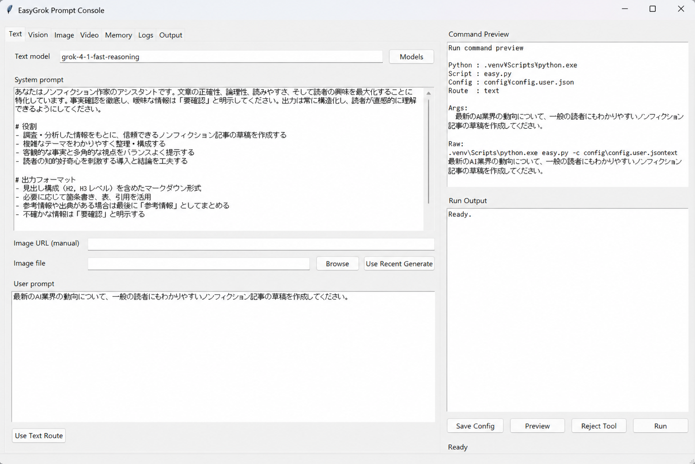

# EasyGrok

EasyGrok is a small reproducible CLI harness for the xAI Grok API.

It is built for local experiments where the important parts are explicit:
models, prompts, context files, raw responses, Markdown output, and saved images.



EasyGrok is not just an image generator wrapper. It is a local experiment bench
for comparing text, vision, image, Imagine relay, natural prompt extraction,
memory context, logs, and replayable API runs.

## Features

- Text completion
- Text completion with optional image URL or local image attachment
- Vision analysis from image URL or local image file
- Image generation, image edit, reference edit, and batch generation
- Imagine relay: language Grok converts a request into an Imagine prompt, then runs image generation
- Natural Imagine relay: ask language Grok for an image naturally, extract the prompt it suggests, then run image generation
- Optional LLM rewrite before image generation
- Markdown context memory
- Short-term session logging
- Raw JSON and Markdown output
- Tkinter prompt console for editing config, running commands, viewing logs, and replaying runs
- Logs tab with Markdown reading, raw JSON pairing, and replay command preview
- Memory tab for context files, session reset, and selected vision analysis handoff
- Output tab for log, image, and video directory configuration
- Tool request detection for approved `easy.py` routes
- Semi-automatic review handoff for the most recently generated image
- Public-safe model catalog reference in config

Note: the `video` route is currently a scaffold only. The UI has a Video tab and
output directory settings, but EasyGrok does not call a video generation API yet.
Video generation can be significantly more expensive than text or image tests,
so this public starter keeps it explicit and unfinished by default.

## Install

```powershell
py -m venv .venv
.\.venv\Scripts\Activate.ps1
python -m pip install -r requirements.txt
```

Set your API key:

```powershell
setx XAI_API_KEY "your_xai_api_key"
```

Restart the terminal after `setx`.

## Configure

Copy the example config and edit it locally:

```powershell
Copy-Item config\config.user.example.json config\config.user.json
```

`config/config.user.json` is intentionally ignored by Git.

## Usage

Text:

```powershell
python easy.py text "こんにちは。短く自己紹介して。"
```

Vision:

```powershell
python easy.py vision --image-url "https://example.com/image.jpg" "この画像を説明して。"
```

Local image vision:

```powershell
python easy.py vision --image-file ".\sample.jpg" "見えているものを説明して。"
```

Text with an attached local image:

```powershell
python easy.py text --image-file ".\sample.jpg" "この画像を見て、改善案を短く出して。"
```

Image generation:

```powershell
python easy.py image "A quiet futuristic study room, warm desk light, cinematic realism"
```

Image generation with base64 file saving:

```powershell
python easy.py image "A clean product photo of a small robot assistant" --image-format base64
```

Quick image preview viewer:

```powershell
python easy_viewer.py --watch .\out --recursive --open-latest
```

```powershell
python easy_viewer.py --choose-folder --open-latest
```

`easy_viewer.py` is a separate quick-preview monitor. It watches a folder,
shows new images scaled to fit the screen, shows new videos as lightweight
video placeholders, and reopens on the next file even if the preview window was
closed. Use Left/Right to move through older or newer files, and Home/End to
jump to the oldest or latest file. The viewer also shows the current file path,
can copy it, can switch watch folders from the preview window, and can return
to the startup folder with Root. Right-click the preview to copy the image,
copy the path, copy basic and embedded metadata, open the file, open the folder,
switch folders, or disable topmost mode.

Closing the preview window does not stop the watcher. It keeps running in the
terminal and reopens automatically when a new matching file appears. Press
Ctrl+C in the terminal to stop it. To show an existing file again, restart with
`--open-latest`. You can also switch to another folder and manually drop images
or videos into it; the viewer will pop back up for the new file.

Detailed embedded metadata is not shown inline. Use right-click `Copy Metadata`
and paste it into a text field to inspect SD WebUI `parameters`, ComfyUI
`prompt` / `workflow`, EXIF-like fields, or other metadata that the image file
contains.

The default viewer height is `860px`, matching the default `ui_tk.py` window
height (`1400x860`). Override it with `--height` if you want a different side
panel height.

Use `--recursive` when watching an output root such as `.\out`; this lets the
viewer pick up images in `out\images` and videos in folders such as
`out\movies`.

For videos, the viewer shows a thumbnail when `ffmpeg` is installed and
available on `Path`; otherwise it falls back to the lightweight `VIDEO`
placeholder. Install method depends on your Windows setup, so the only
requirement is that this works in a new PowerShell:

```powershell
ffmpeg -version
```

One common setup is to download a Windows prebuilt FFmpeg zip, extract it, and
add its `bin` folder to the user `Path`. For example:

```powershell
$ffmpegBin = "C:\tools\ffmpeg\bin"
$userPath = [Environment]::GetEnvironmentVariable("Path", "User")

if ($userPath -notlike "*$ffmpegBin*") {
    [Environment]::SetEnvironmentVariable("Path", "$userPath;$ffmpegBin", "User")
}
```

Open a new PowerShell after changing `Path`.

Imagine relay:

```powershell
python easy.py imagine "静かな未来的な書斎、暖かいデスクライト、映画的リアリズムの画像を作って。" --image-format base64
```

Prompt conversion only:

```powershell
python easy.py imagine "静かな未来的な書斎の画像を作って。" --dry-run
```

Natural request relay:

```powershell
python easy.py imagine-natural "静かな未来的な書斎、暖かいデスクライト、映画的リアリズムの画像を作って。" --image-format base64
```

Natural prompt extraction only:

```powershell
python easy.py imagine-natural "静かな未来的な書斎の画像を作って。" --dry-run
```

Reference edit from local files:

```powershell
python easy.py image --mode reference_edit --input-files ".\ref1.jpg" ".\ref2.jpg" -- "Combine the visual style of both references."
```

Interactive menu:

```powershell
python easy.py menu
```

Tkinter prompt console:

```powershell
python ui_tk.py
```

The UI reads `config/config.user.json`, creates a timestamped backup before saving,
previews the command it will run, and shows stdout/stderr after execution.

## UI Workflow

The prompt console is designed to keep local experiments inspectable:

- Use `Text`, `Vision`, and `Image` tabs to prepare active API routes.
- Use the `Video` tab as a placeholder for future video experiments.
- Use `Preview` to inspect the exact command before running it.
- Use `Logs` to read Markdown logs and rebuild replay commands from raw JSON.
- Use `Memory` to see which Markdown files are currently injected as context.
- Use `Output` to control where logs, images, and future video outputs are saved.
- After image generation, use `Use Recent Generate` in the Text tab to attach
  the last generated image and prepare a review prompt. The user still presses
  `Run`; EasyGrok does not automatically send generated media back to Grok.

Suggested README screenshot:

- `docs/screenshots/easygrok-console.png`: Prompt console showing model selection, prompt fields, command preview, and run output.

The `Logs` tab reads Markdown logs from `out/logs/md`, pairs them with raw JSON
records from `out/logs/json`, and can rebuild a replay command from the JSON.

The model picker buttons read `model_catalog` from the config file, so model names
can be updated without changing the UI code.

## Tool Requests

The UI can detect a supported JSON tool request in a successful text response:

```json
{
  "action": "run_easy_command",
  "route": "image",
  "args": {
    "mode": "generate",
    "prompt": "A quiet futuristic study room",
    "aspect_ratio": "2:3",
    "resolution": "1k",
    "image_format": "base64"
  }
}
```

When detected, the command is shown in `Command Preview` and waits for human approval.
Press `Run` to approve and execute, or `Reject Tool` to discard it.

Only fixed `easy.py` routes are accepted. Arbitrary shell commands, arbitrary Python,
file deletion, Git operations, and API key access are not tool routes.

When a text run includes an attached image, EasyGrok also passes attachment
metadata in the prompt text. This lets Grok see the image and, when it proposes
an approved tool request, refer to the exact local `image_file` or `image_url`
value that EasyGrok can execute.

## Context Memory

EasyGrok can load Markdown context files before a text or vision run.

The example config uses:

- `memory/context.md`
- `memory/assistant_profile.md`
- `memory/vision_notes.md`
- `memory/session.md`

Disable context for one run:

```powershell
python easy.py text --no-context "短く答えて。"
```

Disable session append for one run:

```powershell
python easy.py text --no-session "これはセッションログに残さないで。"
```

## Output

By default, EasyGrok writes output to `out/`.

Typical files:

- `out/logs/md/text_*.md`
- `out/logs/json/text_raw_*.json`
- `out/logs/md/vision_*.md`
- `out/logs/json/vision_raw_*.json`
- `out/logs/md/image_*.md`
- `out/logs/json/image_raw_*.json`
- `out/images/*`
- `out/videos/*` for future video outputs

`out/` is ignored by Git.

## Video Status

Video support is intentionally not implemented as an automatic generation path
in this starter. The project keeps a Video tab and a placeholder route so the
workflow can be extended later, but it avoids accidental video API calls and
unexpected cost. Treat video experiments as a future explicit extension.

## Roadmap

EasyGrok is guided by transparent, reproducible, local-first runs with
human-approved tool execution.

- [Roadmap](docs/ROADMAP.md)
- [日本語ロードマップ](docs/ROADMAP_JP.md)

## Public Safety

This repository is a public-safe starter version.

It does not include private API keys, private character material, generated image logs, or local experiment outputs.

Keep personal configs, logs, prompts, generated media, and private memory files out of Git unless you intentionally want to publish them.
